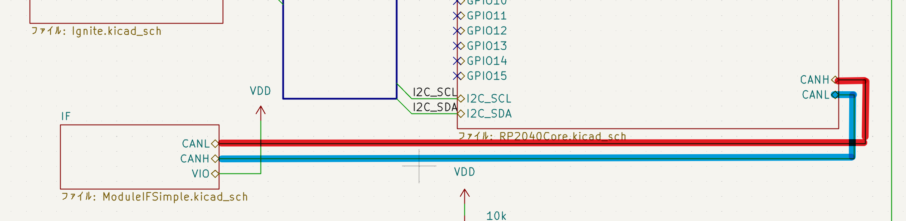

# IGNでCAN通信ができない問題
最終更新日：2026/05/12 
## 目標
IGNモジュールでMissionBus基板とのCAN通信を行う

## 結論
配線が間違っていた．

## 詳細
回路図の段階でCANHとCANLが入れ替わっており，ソフトウェアにより解決することができなかった．
CANトランシーバーのSNHVD65230から先の配線で入れ替わっており，ピン割りて変更等での対応ができなかった．

緊急処置としてCAN用のGroveケーブルを改造することによりIGN-RCS基板間のCAN通信には成功した．ただ，MissionBusを間に入れることで以下の事象が発生した．

- IGN-RCS間の通信は可能
- MissionBusからのパケットも見れる
- MissionBusにUSBを接続しutilでみると2秒に1回MissionBusのみのパケットが送られてくるだけ
- MissionBusの代わりにGS（ESP使用）を用いても同様の減少が起きる
- MissionBusの代わりにLoRa（RP2040使用）を用いると，何ら問題なく動作する．
- IGNをバスから取り除くとMissionBus-RCS間通信は問題なく行える
- MissionBusのSTAT及びERROR LEDの挙動が説明しづらいがおかしい．
  - STATが点灯したままになり，その後ERRORが一瞬点灯するが，util上にエラーメッセージは表示されない

これらの事象より，ESPを用いた基板における受信の際の特有の処理において問題が発生していると考えるが，RCSとの通信は問題なく行えているため修正の必要があるのかは不明．

## 検証の際に行ったこと
- IGNに書き込んでいたコードをそのままRCSに書き込んだところ，
